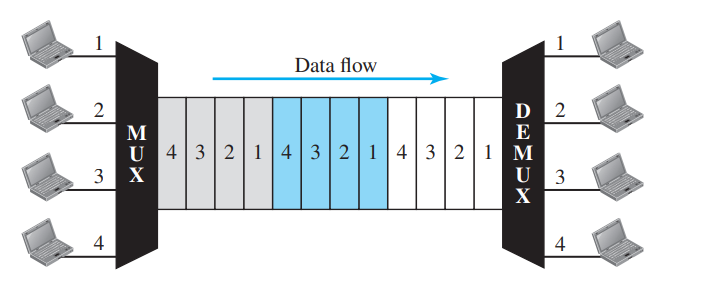

```{r knitr_init, echo=FALSE, error=FALSE, message=FALSE, warning=FALSE, cache=FALSE}
library(knitr)
library(highcharter)
library(rmdformats)
library(magrittr)
library(gsignal)
## Global options
options(max.print="75")
opts_chunk$set(echo=TRUE,
	             cache=TRUE,
               prompt=FALSE,
               tidy=TRUE,
               comment=NA,
               message=FALSE,
               warning=FALSE)
opts_knit$set(width=75)
```

# Multiplexación en el dominio del tiempo

<p style = "text-align: justify">
Como se mencionó en la práctica anterior, existen dos tipos de multiplexación: en el dominio de la frecuencia y en el dominio del tiempo. La multiplexación en el dominio del tiempo, asigna a cada usuario, un intervalo de tiempo $\tau$, en el cual puede transmitir utilizando todo el ancho de banda del canal. La siguiente figura ilustra de mejor manera, la forma en que opera este tipo de multiplexación.
</p>



<p style = "text-align: justify">
Como se puede observar, la multiplexación TDM, toma partes de la señal y las transmite a través del canal de comunicaciones. El principio de operación de la multiplexación TDM (para el caso analógico) es el teorema del muestreo, el cual de manera simplificada dice: </p>

<p style = "text-align: justify">
Se puede recuperar una señal $f(t)$(de banda limitada($F(\omega)=0$ para $\omega>\omega_B$)) siempre y cuando ésta se muestree con frecuecia $\omega \ge 2\omega_B$ o bien en intervalos $T \le 1/2\omega_B$. Al teorema del muestreo también se le conoce como el teorema de muestreo de Nyquist.</p>

## Muestreo de señales

<p style = "text-align: justify">
A continuación veremos la forma de muestrear una señal senoidal de frecuencia $f_0$. Supogamos que tenemos la siguiente señal
</p>

$$
f(t) = \cos(4\pi t).
$$
<p style = "text-align: justify">
Primeramente, debemos observar que la señal coseno es una señal de banda limitada, con ancho de banda $f = 2$Hz, por lo tanto de acuerdo al teorema de muestreo de Nyquist, ésta debe muestrearse a una velocidad de por lo menos $4$Hz. Mostraremos en el siguiente código la forma de la señal orginal y el pulso la muestrará.</p>


```{r sq_cos}
x   <- seq(0,2*10*2*pi, length=1000)
sq  <- square(x, duty=20)
sq  <- 0.5*(1+sq)
t   <- seq(0,2, length=length(x))
ft  <- cos(4*pi*t)
highchart() %>% hc_add_series(cbind(t,sq), name="Square") %>% hc_title(text="Muestreo de señal \\(f(t) = \\cos(2\\pi f t)\\)", useHTML=T) %>% hc_add_theme(hc_theme_db()) %>% hc_xAxis(title=list(text="Tiempo")) %>% hc_yAxis(title = list(text="Valores", useHTML=T), min=-1.3, max = 1.3, allowDecimal = T) %>% hc_chart(zoomType="xy") %>% hc_add_series(cbind(t,ft), name="Información")
```
<p style="text-alilgn: justify">Nótese que la señal  de muestreo es una señal periódica con amplitud uno y su objetivos es tomar muestras de la señal coseno. A continuación se muestra la formula de la señal muestreada</p>

## Demodulación AM


```{r samp}
x   <- seq(0,2*10*2*pi, length=1000)
sq  <- square(x, duty=20)
sq  <- 0.5*(1+sq)
t   <- seq(0,2, length = length(x))
ft  <- cos(4*pi*t)
samp<- sq*ft
highchart() %>% hc_add_series(cbind(t,samp), name="Sampled") %>% hc_add_series(cbind(t, ft), dashStyle = "Dash", name="Original", color = "#ffb703") %>%  hc_title(text="Muestreo de señal coseno", useHTML=T) %>% hc_add_theme(hc_theme_db()) %>% hc_xAxis(title=list(text="Tiempo")) %>% hc_yAxis(title = list(text="Valores", useHTML=T), min=-1.8, max = 1.8, allowDecimal = T) %>% hc_chart(zoomType="xy")
```

## Recuperación de señales muestreadas


<p style="text-alilgn: justify">Una señal muestreada puede recuperarse mediante un filtro pasabaja. Recordemos que un muestreo, al final de cuentas lo que provoca es enriquecer a las señal en el dominio de la frecuencia, replicando su espectro de acuerdo al período de muestreo. A continuación se muestra el proceso de recuperación de la señal coseno.</p>


```{r filtr}
library(gsignal)
library(highcharter)
x   <- seq(0,2*20*2*pi, length=1000)
sq  <- square(x, duty=20)
sq  <- 0.5*(1+sq)
t   <- seq(0,2, length = length(x))
ft  <- cos(4*pi*t)
samp<- sq*ft
def <- butter(5,0.02)
rec <- filter(def, samp)
highchart() %>% hc_add_series(cbind(t,5*rec), name="Recovered") %>% hc_add_series(cbind(t, ft), dashStyle = "Dash", name="Original", color = "#ffb703") %>%  hc_title(text="Recuperación de señal coseno", useHTML=T) %>% hc_add_theme(hc_theme_db()) %>% hc_xAxis(title=list(text="Tiempo")) %>% hc_yAxis(title = list(text="Valores", useHTML=T), min=-1.8, max = 1.8, allowDecimal = T) %>% hc_chart(zoomType="xy")
```

    
    
# Práctica:

Multiplexar las siguientes señales en el dominio del tiempo:

- $\cos(10\pi t)$
- $\cos(20\pi t)$
- $\frac{4}{\pi}\sin(6\pi t) + \frac{1}{3}\sin(18\pi t)$
